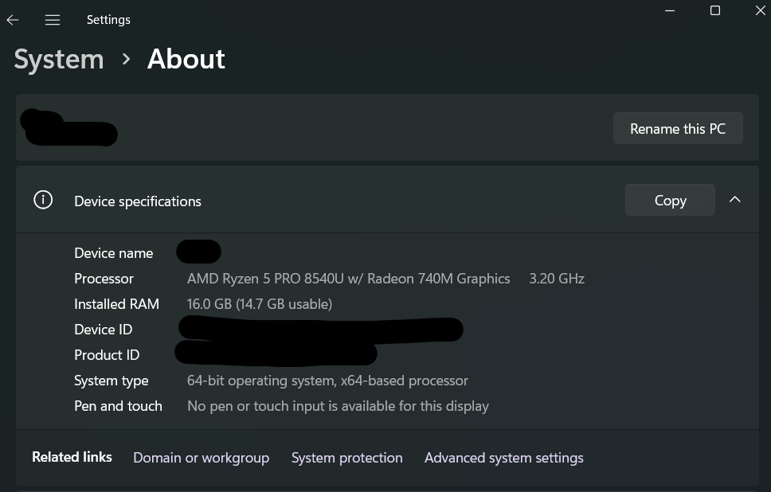
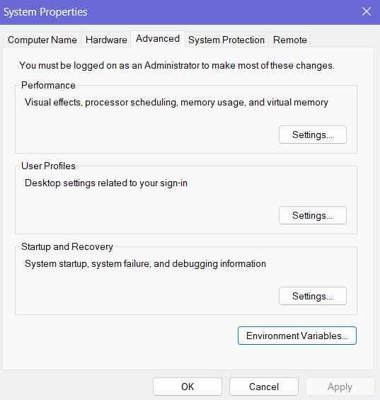

# C Tutorial

Written by Ivy Zhuang, 2024.

## What is C?

C is what many regard as the first modern programming language. It's a general purpose programming language and can be described as low-level with its usage of pointers and memory allocation. Many popular programming languages are based off of C's principles and syntax, some even running C in the background. At SCU, C is taught in CSEN's foundational courses (CSEN 10-12). The purpose of this tutorial is to give you easy-to-access help on these CSEN courses or to guide anyone at SCU interested in learning C.

## How to run C

After you write any program in C, you have to compile it into an executable file. There are many ways to do so and the easiest to use an online IDE like [onlinegdb.com](https://www.onlinegdb.com/online_c_compiler). At SCU, we use the GNU Code Compiler (GCC) in our CSEN courses and this tutorial will help you set up GCC on your local computer. **Ultimately, it's up to you on whether you want to use an online or local compiler.**

## Installation

This tutorial will be using the GNU Code Compiler (GCC) to compile and run code written in C. It's also recommended to install the GNU Debugger (GDB) and the GNU C++ Compiler (G++) if you plan on learning C++ later.

### Windows
The process of installing GCC on Windows is a bit of a tedious task. We will be installing MinGW, which provides GCC and other libraries needed to compile and execute C.

1. Install a compressed archive of MinGW from [here](https://github.com/niXman/mingw-builds-binaries/releases). For 64-bit Windows, install a release with "x86_64", "posix", and "seh" in the filename. For example:


2. Extract the file contents into a location in your file system that you'll remember (preferably not your downloads folder).

3. Go to the folder where you saved MinGW and navigate to the bin directory. Copy the path to the "bin" directory in your MinGW build. Typically, it would be **"C:\\...\mingw64\bin"**.


4. Paste the copied path into your path aka environment variables (commands you can use in the terminal). To do so, go to Settings -> System -> About -> Advanced System Settings -> Environment Variables.




5. Look for the "Path" variable under System Variables. Click the "Edit" button and then add a new line with the copied path.


### MacOS
1. Install Homebrew, a package manager for Mac.
2. Install GCC using the following command:
```shell
brew install gcc
```
### Linux
If you're using a Linux distro and don't know how to install packages...

When you're done, type ` gcc --version` and `gdb --version` in the command prompt to check if everything installed properly.


## Running GCC

## Input & Output

## Variables & Types

## Arrays

## Pointers

## Functions

## Structs & Unions

## Dynamic Memory Allocation

## Further Learning

Our C++ tutorial! (add a link here later)

Useful Practice:
- a

SCU Resources:
- Tutoring

Textbooks for CSEN 10-12:
- The C Programming Language (2nd Ed.) by Brian W. Kernighan & Dennis M. Ritchie
- Data Structures - A Pseudocode Approach with C by Richard F. Gilberg & Behrouz A. Forouzan

Other:
- Another C compiler: Clang