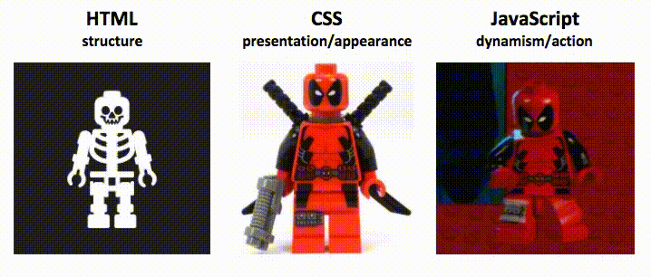

# Javascript Tutorial

Written by Jake Esperson, 2024.

Hello everyone! If you are looking to learn Javacript, you have come to the right place. Javascript is the main language of the web and is used to create interactive websites. In this tutorial, we will cover the basics of Javascript and help you get started with web programming!

First of all, why should you learn Javascript and what can you expect to get out of this?
- You want to get into web development and create interactive websites.
- You want a quick backround for frameworks like React, Angular, and Vue.
- You are curious about the differences between Javascript and Typescript.
- You want a quick refresher on the basics of Javacript.

Now, let's get started!

## Table of Contents
- [Javascript Tutorial](#javascript-tutorial)
  - [Table of Contents](#table-of-contents)
  - [Installation](#installation)
  - [Basics](#basics)
    - [Variables](#variables)
    - [Conditionals](#conditionals)
    - [Loops](#loops)
    - [Input/Output](#inputoutput)
    - [Functions](#functions)
  - [Using Javascript in HTML](#using-javascript-in-html)

## Installation
Javascript is a language that is built into your web browser, so if you are making a full website using HTML/CSS/JS, you don't need to install anything. However, if you want to run Javascript code outside of a browser, you can use Node.js.

- Download the latest version of Node.js from the [official website](https://nodejs.org/en/download/).
- After that is done, see if it is working by opening a command prompt and typing `node --version`. A version number should appear.
- Now that you have Python installed, we need to pick a coding environment. I will be using Visual Studio Code and I would recommend you do the same. You can download it [here](https://code.visualstudio.com/).
- With that, open VSCode and create a new file with the `.js` extension.

Now that you have Node.js installed and a coding environment set up, let's get started with the basics of Javascript.

## Basics
Now, because this will be more focused on web development, we will cover the basics of Javascript as a typical coding language. If you want more details, refer to our C tutorial which covers the basics of programming in general.

### Variables
Variables in Javascript come in two types: `let`, and `const`. `let` is the way to declare a normal variable, while `const` is used for variables that will not change. For example:
```
let x = 5;
const message = "Hello, World!";
```

Notice that we do not need to specify the type of the variable, as Javascript is a dynamically typed language. So, be careful when using variables and don't add different types together.

### Conditionals
Javascript uses the `if`, `else if`, and `else` keywords to create conditionals. For example:
```
if (x > 5) {
    console.log("x is greater than 5");
} else if {
    console.log("x is less than 5");
} else {
    console.log("x is equal to 5");
}
```

### Loops
Loops in Javascript are similar to other languages, with the `for` and `while` loops being the most common. For example:
```
for (let i = 0; i < 5; i++) {
    console.log(i); // prints 0, 1, 2, 3, 4
}

let i = 0;
while (i < 5) {
    console.log(i); // prints 0, 1, 2, 3, 4
    i++;
}
```

### Input/Output
As you may have seen, we use `console.log()` to print to the console. This is the most common way to output in Javascript. To get input, you can use the `prompt()` function. For example:
```
let name = prompt("What is your name?");
console.log("Hello, " + name); // prints "Hello, <name>"
```

### Functions
Functions in Javascript are declared using the `function` keyword. For example:
```
function add(x, y) {
    return x + y;
}

console.log(add(5, 3)); // prints 8
```

Javascript also supports arrow functions (or anonoymous functions), which are a more concise way to write functions and assign them to variables. This is useful when you don't care what the function is called. For example:
```
const add = (x, y) => x + y;

console.log(add(5, 3)); // prints 8
```

A good example of this is when you are using the `map` function on an array. Also, many methods in frameworks like React use arrow functions to define components.
```
// Example of map function
const arr = [1, 2, 3, 4, 5];
const doubled = arr.map(x => x * 2);

// React useEffect example, which is a function but needs to run more than just one line in it
useEffect(() => {
    // code here
}, []);
```


## Using Javascript in HTML
Now that you know the basics of Javascript, let's see how we can use it in a webpage. 

The holy trinity of web development is HTML, CSS, and Javascript. HTML is the structure of the webpage, CSS is the styling, and Javascript is the interactivity.



To start, create new HTML and CSS files, putting whatever you would like. 

